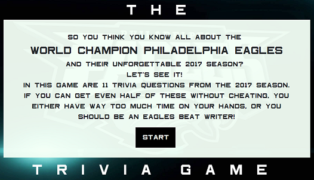
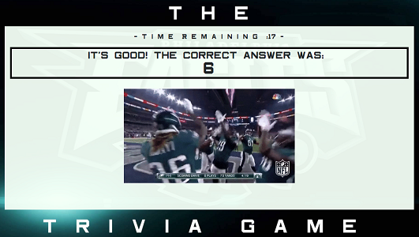
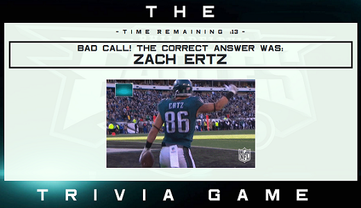

# Philadelphia Eagles Super Bowl Trivia!

[Link to Heroku](http://url/a.png)

[Link to github Pages (Temporary)](https://lii41333733.github.io/trivia-game/)

## Introduction

So you think you know all about the World Champion Philadelphia Eagles and their unforgettable 2017 season? Let's see it! In this game are 11 trivia questions from the 2017 season. If you can get even half of these without cheating, you either have way too much time on your hands, or you should be an Eagles beat writer! You have 20 seconds to answer each trivia question, and at the end you will get a breakdown of the correct and incorrect answers, as well as questions you may have run out of time on. After each question, an animated GIF representative of the question will appear.

## Proof of Concept

The main functionality of the trivia game is highlighted in the use of Javascript timers. Through this project, I was able to make more effective the use of JQuery animations in tandem with the timers without any issues with synchrony.

## Technologies Used
* HTML
* CSS
* JavaScript
* JQuery
* Bootstrap

## Screenshots

### Game Intro

### Example Question

### Correct Answer

### Incorrect Answer

### Game Summary
